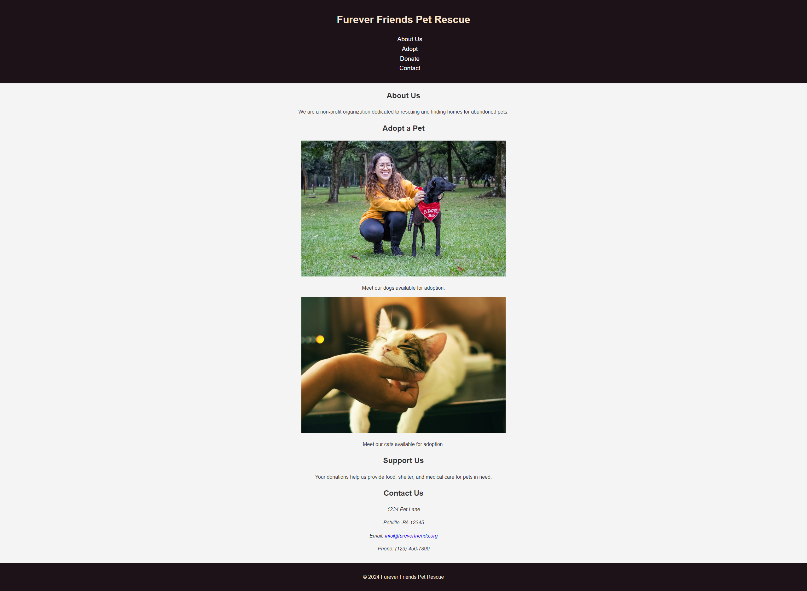
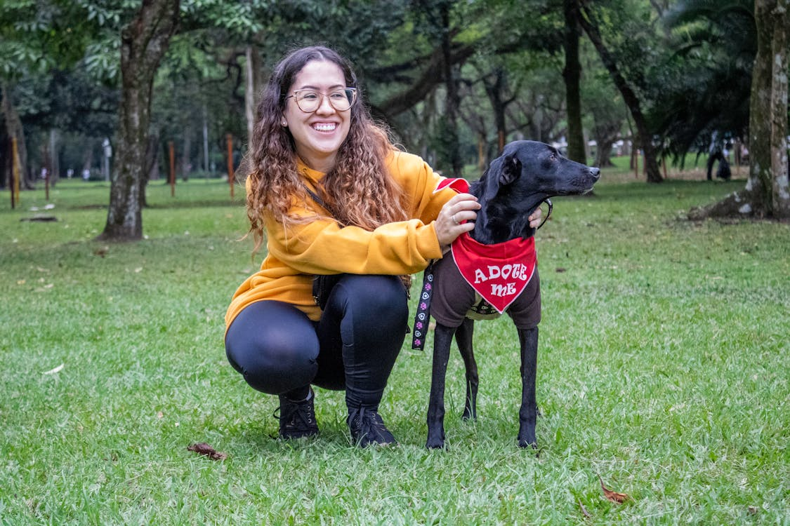

 

# Furever Friends Pet Rescue Landing Page

## Description 📄
For this assignment, our team has been hired to create a visually appealing landing page for a growing pet adoption shelter, Furever Friends Pet Rescue.

You are a junior developer learning the ropes, and your task is to learn and apply CSS class selectors to style various elements on the page. This will empower you to create professional and maintainable web designs, which will open doors for your career as a web developer.

Now, let's elevate your CSS skills by practicing some class selectors and understanding how to apply styles consistently to a project.

---

## ToDo list ✅
**Attention**: When you complete a task, put an `x` in the middle of the brackets to mark it off your ToDo list.

1. [ ] Create a new CSS file named `styles.css` in your project directory.
2. [ ] Link the newly created CSS file to your `index.html` file by adding the following line within the `<head>` section:

    ```html
    <link rel="stylesheet" href="styles.css">
    ```

### Adding and Linking the CSS File

3. [ ] In your HTML file, locate the `<header>` element and add the `class="header"` attribute to it:

    ```html
    <header class="header">
        <h1>Furever Friends Pet Rescue</h1>
        <nav>
            <ul>
                <li><a href="#about" class="nav-link">About Us</a></li>
                <li><a href="#adopt" class="nav-link">Adopt</a></li>
                <li><a href="#donate" class="nav-link">Donate</a></li>
                <li><a href="#contact" class="nav-link">Contact</a></li>
            </ul>
        </nav>
    </header>
    ```

### Base Styles

4. [ ] Style the `header` class in your `styles.css` file:

    ```css
    .header {
        background: #1e1219;
        color: #f9e4cc;
        padding: 1rem 0;
        text-align: center;
    }
    ```

    **Explanation**: The `text-align` property is used to center the text within the header. This ensures that all the content within the header is aligned to the center.

### Styling the Navigation Links

5. [ ] Add the `class="nav-link"` attribute to each of the navigation links in your HTML:

    ```html
    <li><a href="#about" class="nav-link">About Us</a></li>
    <li><a href="#adopt" class="nav-link">Adopt</a></li>
    <li><a href="#donate" class="nav-link">Donate</a></li>
    <li><a href="#contact" class="nav-link">Contact</a></li>
    ```

6. [ ] Style the `nav-link` class in your `styles.css` file:

    ```css
    .nav-link {
        color: #fff;
        text-decoration: none;
        font-size: 1.2rem;
    }

    .nav-link:hover {
        text-decoration: underline;
        color: #ffddb7;
    }
    ```

    **Explanation**: The `:hover` pseudo-class is used to apply styles to an element when the user hovers over it with a mouse. This is commonly used to enhance user interaction and provide visual feedback. In this case, when the user hovers over a navigation link, it will underline the text and change the color to a lighter shade, making the link more noticeable.

7. [ ] Notice the dots way off on the left side of the screen? They're from our `<ul>` which would normally have bullets. We want to remove the bullets from the ul in our nav, so we'll target it and then apply `list-style: none;` to our `<ul>`: 
    ```css
    nav ul {
        list-style: none;
    }
    ```
    **Explanation**: Using the `list-style` property allows us to change how lists look. By writing `nav ul` with a space between the element selectors like that, we tell the browser to apply our code only to `<ul>` elements found inside of a `<nav>` element, which will keep it from removing bullets from lists in other parts of our site. 

### Adjusting Image Sizes

8. [ ] In your HTML file, locate the `` elements and add the `class="pet-img"` attribute to each:

    ```html
    
    
    ```

9. [ ] Style the `pet-img` class in your `styles.css` file:

    ```css
    .pet-img {
        height: 30vh;
    }
    ```

    **Recall**: In responsive design, using `vh` (viewport height) helps us have adaptable heights that adjust to different screens.

### Styling the Footer

10. [ ] In your HTML file, locate the `<footer>` element and add the `class="footer"` attribute to it:

    ```html
    <footer class="footer">
        <p>&copy; 2024 Furever Friends Pet Rescue</p>
    </footer>
    ```

11. [ ] Style the `footer` class in your `styles.css` file:

    ```css
    .footer {
        background: #1e1219;
        color: #f9e4cc;
        text-align: center;
        padding: 1rem 0;
        margin-top: 2rem;
    }
    ```

### Aligning Text in Sections

12. [ ] What do you think could make the page better? One improvement could be better aligning the text on the page. Add the `class="section"` attribute to each section in your HTML like this:

    ```html
    <section id="about" class="content-section">
        <h2>About Us</h2>
        <p>We are a non-profit organization dedicated to rescuing and finding homes for abandoned pets.</p>
    </section>
    ```

13. [ ] Style the `content-section` class in your `styles.css` file to update all sections at once:

    ```css
    .section {
        text-align: center;
    }
    ```

---

🎊 **AWESOME WORK! You just created a beautifully styled header, navigation bar, and sections with hover effects and centered text! 💃🏻🕺🏾** 🎊

While there's more to be done to this page in future activities, such as creating a properly styled menu, you've already learned a lot and greatly improved the page's appearance. Congratulations!

---

### Solution codebase 👀
🛑 **Only use this as a reference** 🛑

💾 **Not something to copy and paste** 💾

**Note:** This lab references a solution file located [here](https://github.com/HackerUSA-CE/sdai-ic-d4-css-classes/tree/solution)
